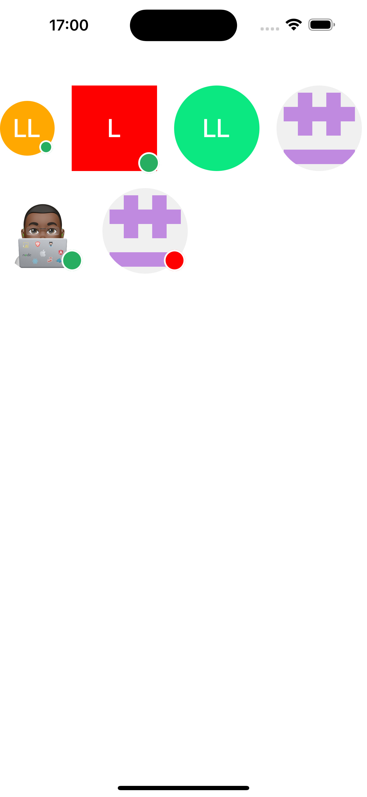

<p align='center'>

</p>

<h1 align="center">Avatar React Native</h1>

<p align="center">
  <a href="https://www.npmjs.com/package/@luanyata/react-native-avatar"></a>
  <a href="https://www.npmjs.com/package/@luanyata/react-native-avatar"></a>
  
   <a href="https://www.linkedin.com/in/luanyata/">
    
  </a>
    
  <a href="https://github.com/luanyata/react-native-avatar/stargazers">
    
  </a>
  </p>

## Tecnologies

- [React Native](https://reactnative.dev/)
- [TypeScript](https://www.typescriptlang.org/)
- [Jest](https://jestjs.io/)
- [Prettier](https://prettier.io/)
- [ESLint](https://eslint.org/)
- [React Native Builder Bob](https://github.com/callstack/react-native-builder-bob)


## Installation

```sh
npm install @luanyata/react-native-avatar

#or

yarn add @luanyata/react-native-avatar
```

## Usage

```js
import { Avatar } from "@luanyata/react-native-avatar";

// ...

<Avatar
  size={100}
  name="Luan Lima"
  src="https://avatars.githubusercontent.com/u/39541807?v=4"
/>
```

## Props

<table class="table">
<thead><tr>
  <th>Name</th><th>Default</th><th>Type</th><th>Description</th>
</tr></thead>
<tbody>
  <tr><td>userName</td>
    <td> - </td>
    <td> String </td>
    <td>The user name that will be used to compute user initials.</td></tr>
  <tr><td>initialName</td>
    <td> - </td>
    <td> String </td>
    <td>Force the displayed initials by overriding the computed ones.</td></tr>
  <tr><td>src</td>
    <td> - </td>
    <td> String </td>
    <td>Path of image.</td></tr>
  <tr><td>active</td>
    <td> false </td>
    <td> Boolean </td>
    <td>Whether the user is active or not.(Show active circle around avatar)</td></tr>
  <tr><td>textColor</td>
    <td> #FFFF </td>
    <td> String </td>
    <td>The font color used to render the user initials</td></tr>
    <tr><td>activeCircleColor</td>
    <td> #27ae60 </td>
    <td> String </td>
    <td>Background color active circle</td></tr>
  <tr><td>size</td>
    <td> 64 </td>
    <td> Number </td>
    <td>The avatar size</td></tr>
  <tr><td>rounded</td>
    <td> false </td>
     <td> Boolean </td>
    <td>True if the avatar must be rounded.</td></tr>
     <tr><td>loaderColor</td>
    <td> #aaa69d </td>
    <td> String </td>
    <td>The color of loader</td></tr>
     <tr><td>backgroundColor</td>
    <td> - </td>
    <td> String </td>
    <td>The avatar background color to use if no image is provided</td></tr>
    <tr><td>backgroundColors</td>
    <td> ['#575fcf', '#ef5777', '#0be881'] </td>
    <td> Array </td>
    <td>Array of background colors to choose from, if no background color is specified</td></tr>
   </tbody>
</table>

## Contributing

Inspired by [react-native-user-avatar](
  https://github.com/muhsin-k/react-native-user-avatar
). Thank you [Muhsin Keloth](https://github.com/muhsin-k/react-native-user-avatar.git)


See the [contributing guide](CONTRIBUTING.md) to learn how to contribute to the repository and the development workflow.

## License

MIT

---

Made with [create-react-native-library](https://github.com/callstack/react-native-builder-bob)
